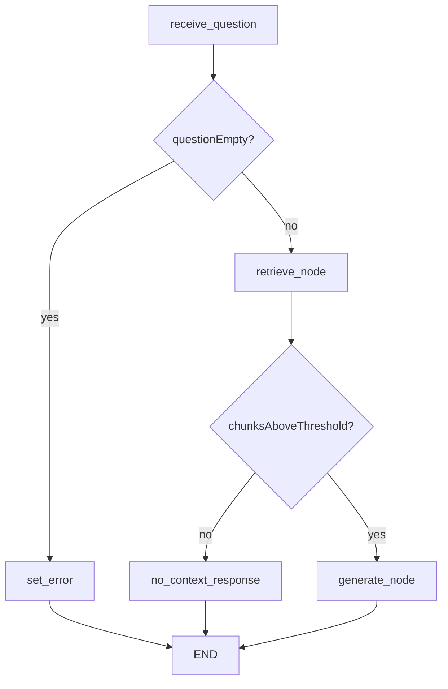

# TrackFlow Support Knowledge Agent

Commercial knowledge assistant for account managers, implemented as an explicit **LangGraph** over the Milestone 7 RAG pipeline.

## Goal

Answer prospect and client questions the way a TrackFlow salesperson would — grounded in indexed policy docs, with conditional routing when retrieval fails or the question is invalid.

## Graph



Nodes call `retrieve()` and `generate_answer()` from [`data/pipelines/rag.py`](../../data/pipelines/rag.py) separately — never the monolithic `query()`.

## API

`POST /agent/query` (incident-api) coexists with `POST /knowledge/query`:

```bash
curl -X POST http://localhost:8001/agent/query \
  -H 'Content-Type: application/json' \
  -d '{"question":"Can we promise 3-5 day SLA during Black Friday?"}'
```

Response:

```json
{
  "answer": "...",
  "sources": [{"source_document": "...", "section": "...", "language": "en"}],
  "trace_id": "uuid"
}
```

Inspect the execution trace after a run:

```python
from agents.support_agent.trace import get_trace
get_trace(trace_id)
```

## Tests

```bash
PYTHONPATH=. python -m pytest tests/pipelines/test_agent_graph.py -q
```

Also included in `bash scripts/test-python.sh`.

## Optional LangSmith

Set `LANGCHAIN_TRACING_V2=true` and `LANGCHAIN_API_KEY` to mirror traces to LangSmith. In-process trace storage works without external credentials.
