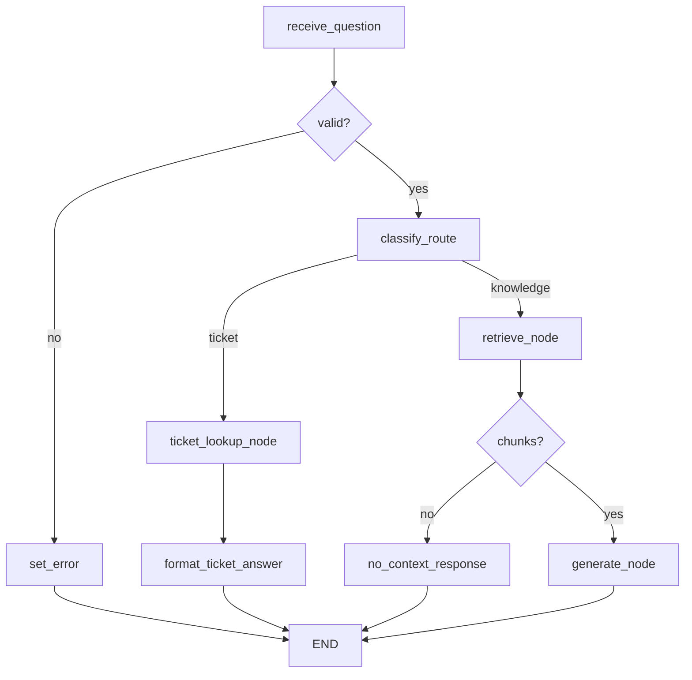

# TrackFlow Support Knowledge Agent

Commercial knowledge assistant for account managers, implemented as an explicit **LangGraph** over the Milestone 7 RAG pipeline with an optional **incident ticket tool** for operational lookups.

## Goal

Answer prospect and client questions the way a TrackFlow salesperson would — grounded in indexed policy docs — and look up real incident ticket status from the incident manager when the question is operational.

## Graph



- **Knowledge path:** `retrieve()` + `generate_answer()` from [`data/pipelines/rag.py`](../../data/pipelines/rag.py)
- **Ticket path:** [`agents/tools/incident_lookup.py`](../tools/incident_lookup.py) calls real `GET /api/incidents` over HTTP — never simulated data

Routing is automatic from question content (incident ID or ticket keywords → tool; otherwise → RAG).

## API

`POST /agent/query` (incident-api) coexists with `POST /knowledge/query`:

```bash
# Policy / knowledge question
curl -X POST http://localhost:8001/agent/query \
  -H 'Content-Type: application/json' \
  -d '{"question":"What is the standard return window?"}'

# Ticket lookup question
curl -X POST http://localhost:8001/agent/query \
  -H 'Content-Type: application/json' \
  -d '{"question":"What is the status of incident inc_abc123..."}'
```

Response:

```json
{
  "answer": "...",
  "sources": [{"source_document": "...", "section": "...", "language": "en"}],
  "trace_id": "uuid",
  "sources_used": ["rag"]
}
```

Ticket answers use `"sources_used": ["ticket_tool"]` and empty `sources` (no KB citations).

## Environment

| Variable | Default | Purpose |
|----------|---------|---------|
| `INCIDENTS_API_URL` | `http://localhost:8001` | Incident manager base URL for ticket tool |
| `INCIDENT_TOOL_TIMEOUT_SECONDS` | `5.0` | HTTP timeout for ticket lookups |

## Trace inspection

```python
from agents.support_agent.trace import get_trace
get_trace(trace_id)
```

Each run records node order plus whether `rag` or `ticket_tool` was used.

## Tests

```bash
PYTHONPATH=. python3 -m pytest tests/pipelines/test_agent_graph.py tests/pipelines/test_agent_tools.py -q
```

Also included in `bash scripts/test-python.sh`.
