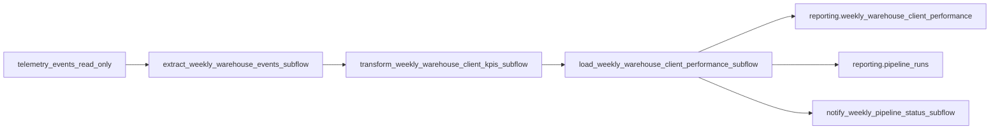

# TrackFlow — Weekly Warehouse & Client Performance Pipeline Design

## Purpose

Produce the **Weekly Warehouse & Client Performance Report** for Thomas (CEO) and Ana (Head of Warehouse Operations): a Monday-morning rollup of **Inbound Volume**, **Outbound Throughput**, **Stockout Frequency**, and **Discrepancy Rate** per warehouse (`los_angeles` / `zaragoza`) and `client_id`, built from mandatory telemetry events `inbound_order_created`, `outbound_order_created`, `stock_threshold_triggered`, and `inventory_discrepancy_detected`.

---

## Current State

### What we already have

| Asset | Location | Notes |
|-------|----------|--------|
| Telemetry envelope + event schemas | [`event-schemas.json`](../../event-schemas.json), [`telemetry_full_plan/`](../../telemetry_full_plan/) | schemaVersion `1.0.0`; inventory props: `warehouse`, `client_id`, `product_id`, `product_category`, `quantity` |
| Event store | `public.telemetry_events` (Supabase) | Envelope columns + domain fields in `tags` JSONB; immutable (no UPDATE/DELETE) |
| Ingest + engineering report | [`services/telemetry/`](../../services/telemetry/) | `POST /telemetry/events`, `GET /telemetry/report` (Pandas technical metrics) |
| Inventory demo API | [`services/inventory/`](../../services/inventory/) | In-memory seed stock; not the reporting source |

### Gap

`GET /telemetry/report` answers **engineering** questions (events per day, error rates, volume by warehouse). It does **not** produce the executive deliverable: a **per-warehouse, per-client, ISO-week** rollup of inbound units, outbound orders, stockouts, and discrepancy rate that directors currently assemble by hand every Sunday night.

That unanswered business question is what this pipeline closes — without modifying `services/telemetry/analysis.py` or `GET /telemetry/report`.

---

## Extraction format

| Item | Detail |
|------|--------|
| Source | `public.telemetry_events` (read-only). Local fallback: `data/raw/telemetry_events.jsonl` when Supabase credentials are absent |
| Format | Rows with `event_type`, `timestamp`, and `tags` (or `properties`) holding `warehouse`, `client_id`, `quantity` |
| Filter | `event_type` IN (`inbound_order_created`, `outbound_order_created`, `stock_threshold_triggered`, `inventory_discrepancy_detected`) |
| Cadence | **Weekly** — intended schedule Monday ~07:00 (UTC Monday morning), covering the prior ISO week; also runnable on demand via CLI / API |
| How source updates | Telemetry is append-only (REVOKE UPDATE/DELETE). Re-runs re-aggregate the same week window and upsert destinations — no source rewrite hazards |

---

## Data flow



Three separated stages:

1. **Extract** — pull filtered warehouse/client events for the target ISO week (or seed JSONL offline).
2. **Transform** — aggregate to grain `(warehouse, client_id, week_start)` and compute the four KPI fields.
3. **Load** — upsert into `reporting.weekly_warehouse_client_performance` and append `reporting.pipeline_runs`.

Optional **notify** is invoked with `return_state=True` so a notify failure does not fail the ETL.

---

## Handling updates / duplicate avoidance

Even though `telemetry_events` is append-only, operators may re-run the pipeline for the same week. Strategy:

1. Recompute the full week grain from source events.
2. Upsert destination rows keyed by `unique (warehouse, client_id, week_start)`.
3. Result after two identical runs is byte-identical KPI values (idempotent load).

---

## Destination tables (`reporting` schema)

### `reporting.weekly_warehouse_client_performance`

Grain: one row per warehouse × client × ISO week (`week_start` = Monday UTC).

| Column | KPI |
|--------|-----|
| `inbound_units_count` | Inbound Volume — sum of quantities from `inbound_order_created` |
| `outbound_orders_count` | Outbound Throughput — count of `outbound_order_created` |
| `stockout_events_count` | Stockout Frequency — count of `stock_threshold_triggered` |
| `discrepancy_events_count` | Supporting count of `inventory_discrepancy_detected` |
| `discrepancy_rate` | `discrepancy_events_count / outbound_orders_count` (0 if no orders) |

### `reporting.pipeline_runs` (execution log)

| Field | Why |
|-------|-----|
| `id` | Stable run identity for API lookups |
| `started_at` / `finished_at` | Duration and schedule auditing |
| `records_processed` | Volume signal for capacity/cost |
| `status` | Running / Completed / Failed |
| `error_message` | Production diagnosis without Prefect UI |
| `week_start` | Which ISO week the run targeted |

---

## Idempotency strategy

Load uses **upsert** on `unique (warehouse, client_id, week_start)`. If the load phase fails mid-write and is re-run:

- Already-inserted rows for that week are overwritten with the same recomputed values.
- No duplicate rows can exist under the unique constraint.
- Run log always inserts a **new** row per attempt (append-only audit trail).

Local offline mode mirrors the same unique key in SQLite.

---

## Prefect mapping

| Concept | TrackFlow name |
|---------|----------------|
| Main flow | `weekly_warehouse_client_performance_etl` |
| Subflows | `extract_weekly_warehouse_events_subflow`, `transform_weekly_warehouse_client_kpis_subflow`, `load_weekly_warehouse_client_performance_subflow`, `notify_weekly_pipeline_status_subflow` |
| Tasks | `extract_weekly_warehouse_events`, `compute_inbound_units_count`, `compute_outbound_orders_count`, `compute_stockout_events_count`, `compute_discrepancy_rate`, `assemble_weekly_warehouse_client_rows`, `load_weekly_warehouse_client_performance`, `record_pipeline_run`, `notify_weekly_pipeline_status` |
| Relevant states | Running → Completed \| Failed (notify may Complete/Failed independently via `return_state=True`) |
| Blocks / credentials | Supabase URL + service role key via env (`SUPABASE_URL`, `SUPABASE_SERVICE_ROLE_KEY` / `SUPABASE_KEY`); production would store these as a Prefect Secret/JSON block named e.g. `trackflow-supabase` |

---

## Application integration (design)

New module [`services/reporting/`](../../services/reporting/) — separate from `services/telemetry/`:

| Endpoint | Calls |
|----------|--------|
| `GET /reporting/weekly-warehouse-client-performance` | Reads destination table (no ETL in services) |
| `GET /reporting/pipeline-runs/latest` | `get_latest_pipeline_run()` from `data/pipelines/pipeline.py` |
| `POST /reporting/pipeline-runs` | Invokes `weekly_warehouse_client_performance_etl` from `data/pipelines/pipeline.py` |

No ETL logic lives in `services/`.

---

## Schedule and run command

- **Schedule:** Mondays at ~07:00 (UTC Monday morning) so leadership opens the weekly report with prior-week data.
- **CLI:** from monorepo root:

```bash
python data/pipelines/pipeline.py
```

Optional week override: `WEEK_START=2026-07-06 python data/pipelines/pipeline.py`
