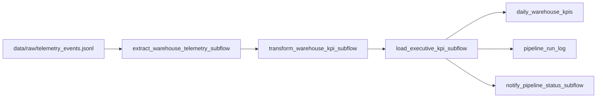

# TrackFlow Warehouse Telemetry ETL — Pipeline Design

## Purpose

Nightly ETL turns warehouse fulfillment telemetry (`outbound_order_created`, `inbound_order_created`, `product_created`) into idempotent daily KPIs for Los Angeles and Zaragoza so executives stop assembling Monday reports by hand.

---

## Current State Analysis

### Telemetry events already defined

TrackFlow’s telemetry schema (`schemaVersion` `1.0.0`) lives under [`telemetry-stream/event-schemas.json`](./telemetry-stream/event-schemas.json) and is documented in [`docs/telemetry/telemetry-plan.md`](../../docs/telemetry/telemetry-plan.md).

**Envelope fields:** `eventId`, `timestamp`, `sessionId`, `userId`, `event_type`, `schemaVersion`, `requestId`, `properties`.

**`event_type` catalog:**

| Category | Types |
|----------|--------|
| Auth / session | `session_started`, `credential_failed`, `session_expired` |
| Catalog | `product_created`, `product_create_rejected` |
| Fulfillment | `inbound_order_created`, `outbound_order_created`, `outbound_order_rejected` |
| Stock alerts | `stock_threshold_triggered` |
| UX | `page_viewed`, `form_abandoned` |

Fulfillment event properties include: `order_id`, `product_id`, `sku`, `quantity`, `warehouse_location` (`los_angeles` \| `zaragoza`), `client_brand`.

### Where data lives today

| Asset | Location | Notes |
|-------|----------|--------|
| Event schemas + sample | `data/pipelines/telemetry-stream/` | Design + validation only |
| Seed batch for this pipeline | `data/raw/telemetry_events.jsonl` | Local JSONL source for nightly extract |
| Inventory ORM / API | `services/inventory-api/` | Products, inbound/outbound orders (Supabase or SQLite) |
| KPI business logic (TS) | `packages/shared/business-logic/milestone2.ts` | Computes shipment volume / rates — country enums still need US/Spain alignment |

There is not yet a live centralized event store; this pipeline treats `data/raw/telemetry_events.jsonl` as the batch extraction source (standing in for a future Supabase `telemetry_events` table).

### Reports already generated with Pandas

There is no production Pandas report in the monorepo yet. The only Pandas script is a generic cleaning skill at `skills/data-analysis/scripts/pandas_clean.py`. Milestone 2 executive KPI math exists in TypeScript, not as a Python pipeline. **Limitation:** a mid-run script crash leaves no run log, and re-running ad-hoc scripts can double-count without upsert keys.

---

## Pipeline Design

### Extraction format

| Item | Detail |
|------|--------|
| Source | File `data/raw/telemetry_events.jsonl` (one JSON envelope per line) |
| Optional future source | Supabase / Postgres `telemetry_events` via `DATABASE_URL` Prefect block |
| Format | JSON telemetry envelopes matching schema `1.0.0` |
| Cadence | **Nightly** after both warehouses close (planned ~06:00 UTC, covering prior LA + Zaragoza business day) |
| Filtered types | `outbound_order_created` (primary), plus `inbound_order_created` and `product_created` for context metrics |

### Data flow



### Handling updates to existing records

Source systems may rewrite an outbound order quantity after the fact. Strategy for TrackFlow:

1. Extract events for a **business-date window** (UTC date derived from `timestamp`).
2. Re-aggregate KPIs for that window by natural key `(metric_date, warehouse_location, client_brand)`.
3. **Upsert** into `daily_warehouse_kpis` on that key so corrections replace the snapshot instead of inserting duplicates.

If the same `eventId` appears twice in the source file, extract de-duplicates by `eventId` before transform.

### Idempotency strategy

If the pipeline fails during load and is re-run:

- KPI rows use SQLite/`INSERT OR REPLACE` (or SQL upsert) on `(metric_date, warehouse_location, client_brand)`.
- Re-running the same window produces **identical** KPI rows after both runs.
- Each attempt writes a new `pipeline_run_log` row (audit trail), not a second KPI row for the same key.

### Execution log (minimum fields)

| Field | Why |
|-------|-----|
| `started_at` | Audit when the run began |
| `finished_at` | Measure duration and confirm completion |
| `records_processed` | Volume / cost monitoring |
| `status` | `Completed` / `Failed` for ops dashboards |
| `error_message` | Debug production failures |
| `flow_run_id` | Correlate with Prefect UI / API triggers |

---

## Mapping to Prefect

| Concept | TrackFlow mapping |
|---------|-------------------|
| **Main flow** | `trackflow_warehouse_telemetry_etl` |
| **Subflows** | `extract_warehouse_telemetry_subflow`, `transform_warehouse_kpi_subflow`, `load_executive_kpi_subflow`, `notify_pipeline_status_subflow` |
| **Tasks** | `extract_outbound_order_events`, `transform_warehouse_shipment_kpis`, `load_executive_kpi_snapshot`, `notify_pipeline_status` |
| **States** | `Running` while stages execute; `Completed` on successful load + log; `Failed` on extract/load hard failures. Notify uses `return_state=True` so a notify `Failed` does not fail the main flow. |
| **Blocks** | Supabase / `DATABASE_URL` connection string (or local SQLite path for homework); optional Slack/webhook for notify |

---

## Schedule and run command

- **Intended schedule:** nightly batch (~06:00 UTC), aligned with the telemetry plan’s nightly mode for `outbound_order_created` / `inbound_order_created` / `product_created`.
- **CLI:**

```bash
# from monorepo root (with data/pipelines requirements installed)
python data/pipelines/pipeline.py
```

- **API (manual trigger):** `POST /pipeline/runs` on the inventory API (authenticated).
- **Latest run metadata:** `GET /pipeline/runs/latest`.
