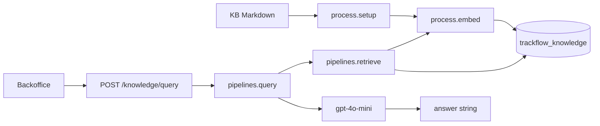

# TrackFlow RAG Design

## Overview

TrackFlow’s Milestone 7 knowledge assistant helps commercial account managers answer prospect and client questions the way a salesperson would on a call: with exact contractual terms from the indexed knowledge base, and without inventing discounts, SLAs, or exceptions.

Source corpus:

- `docs/company-knowledge-base/trackflow-sla-delivery.en.md`
- `docs/company-knowledge-base/trackflow-returns-policy.en.md`
- `docs/company-knowledge-base/trackflow-carrier-coverage.en.md`
- `docs/company-knowledge-base/trackflow-storage-pricing.en.md`

Code layout (course split):

| Responsibility | Module |
|---|---|
| Chunking + indexing (`setup`, `embed`) | `data/process/rag.py` |
| Retrieval + generation (`retrieve`, `query`) | `data/pipelines/rag.py` |
| HTTP | `POST /knowledge/query` in `services/incident-api` |
| UI | `uis/backoffice/app/knowledge` |

---

## End-to-end RAG process

```text
1. setup()
   docs/company-knowledge-base/*.md
        -> heading-based chunks
        -> embed(chunk_text)
        -> upsert into Qdrant collection `trackflow_knowledge`

2. Query time
   User question (UI or API)
        -> retrieve(): embed(question) + Qdrant top-k + min_score filter
        -> prompt assembly (salesperson system prompt + retrieved text)
        -> generation LLM (chat/completions)
        -> answer string only ({"answer": "..."})
```



---

## Chunking strategy

**Method:** hybrid of heading-level and semantic-section chunking.

Each Markdown H1–H3 section becomes one chunk. The section title is kept with the body so retrieval returns self-contained policy units (for example an entire “High-demand peak dates warning” section).

**Why it fits this corpus:** The four commercial docs are structured as titled policy sections with rules, rates, and conditions. Cutting mid-paragraph would split SLAs, approval rules, or carrier recommendations. Heading boundaries preserve those semantic units.

**Integrity:** Chunks are never split mid-sentence; a section is kept whole. Each document yields at least three chunks (one per major section).

**Approximate sizes:** ~150–450 words per chunk; typically 4 sections × 4 documents ≈ 16 indexed points.

**Idempotency:** `setup()` uses a **clear-and-reload** strategy (delete + recreate collection), plus deterministic UUIDv5 point IDs from `(source_document, chunk_index)` so re-runs do not duplicate points.

---

## Embedding practices

| Role | Model ID | Notes |
|---|---|---|
| Embeddings | `text-embedding-3-small` | Used by `embed()` at index **and** query time |
| Generation | `gpt-4o-mini` | Chat/completions only; never used for vectors |

Both models are consumed through an OpenAI-compatible client (`OPENAI_BASE_URL` / `OPENAI_API_KEY`), suitable for 4Geeks-provided student gateways.

**Qdrant configuration**

- Collection: `trackflow_knowledge`
- Vector size: **1536**
- Distance: **Cosine**

**Preprocessing before embed:** normalize newlines, collapse repeated whitespace, strip ends. No stemming or aggressive rewriting (preserves commercial numbers).

**Retrieval tuning**

- Default `k=5`
- Default `min_score=0.55` (`RAG_MIN_SCORE`)
- Results below the threshold are dropped, so the function may return fewer than `k` hits
- Threshold chosen as a starting commercial filter: high enough to drop weak neighbors on short eval questions, low enough to keep recall for paraphrases (Black Friday / Sales peaks, rural Aragón, return window). Tune against `data/eval/test-queries.json` targeting Recall@3 ≥ 80%.

**Payload fields**

`company`, `source_document`, `section`, `language`, `chunk_index`, `text`

---

## Generation behavior

`query()` builds a salesperson system prompt that:

- Uses only retrieved context
- Refuses to invent terms when nothing passes `min_score`
- Never promises standard SLAs on declared high-demand dates
- Describes international returns as manual (never automatic)
- Requires Miguel Torres approval language for storage discounts

The HTTP response returns **only** `{ "answer": "<generated string>" }`. Chunk lists and scores stay in server logs.

---

## How to run locally

1. Start Qdrant (and optional API stack): `docker compose up -d qdrant`
2. Export `OPENAI_API_KEY` (and optional `OPENAI_BASE_URL`)
3. Index: `PYTHONPATH=. python -m data.process.rag`
4. API: run uvicorn for `services/incident-api` with repo root on `PYTHONPATH`
5. UI: `uis/backoffice` → `/knowledge`
6. Tests: `python -m pytest tests/pipelines/test_rag.py`
