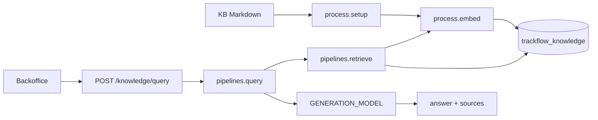

# TrackFlow RAG Design

## Overview

TrackFlow’s Milestone 7 knowledge assistant helps commercial account managers answer prospect and client questions the way a salesperson would on a call: with exact contractual terms from the indexed knowledge base, and without inventing discounts, SLAs, or exceptions.

Source corpus:

- `docs/company-knowledge-base/trackflow-sla-delivery.en.md`
- `docs/company-knowledge-base/trackflow-returns-policy.en.md`
- `docs/company-knowledge-base/trackflow-carrier-coverage.en.md`
- `docs/company-knowledge-base/trackflow-storage-pricing.en.md`

Code layout (course split):

| Responsibility | Module |
|---|---|
| Chunking + indexing (`setup`, `embed`) | `data/process/rag.py` |
| Retrieval + generation (`retrieve`, `query`) | `data/pipelines/rag.py` |
| HTTP | `POST /knowledge/query` in `services/incident-api` |
| UI | `uis/backoffice/app/knowledge` |

---

## End-to-end RAG process

```text
1. setup()
   docs/company-knowledge-base/*.md
        -> heading-based chunks
        -> embed(chunk_text)
        -> upsert into Qdrant collection `trackflow_knowledge`

2. Query time
   User question (UI or API)
        -> retrieve(): embed(question) + Qdrant top-k + min_score filter
        -> prompt assembly (salesperson system prompt + retrieved text)
        -> generation LLM (chat/completions)
        -> {"answer": "<generated string>", "sources": [{source_document, section, language}]}
```



---

## Chunking strategy

**Method:** hybrid of heading-level and semantic-section chunking.

Each Markdown H1–H3 section becomes one chunk. The section title is kept with the body so retrieval returns self-contained policy units (for example an entire “High-demand peak dates warning” section).

**Why it fits this corpus:** The four commercial docs are structured as titled policy sections with rules, rates, and conditions. Cutting mid-paragraph would split SLAs, approval rules, or carrier recommendations. Heading boundaries preserve those semantic units.

**Integrity:** Chunks are never split mid-sentence; a section is kept whole. Each document yields at least three chunks (one per major section).

**Approximate sizes:** ~150–450 words per chunk; typically 4 sections × 4 documents ≈ 16 indexed points.

**Idempotency:** `setup()` uses a **clear-and-reload** strategy (delete + recreate collection), plus deterministic UUIDv5 point IDs from `(source_document, chunk_index)` so re-runs do not duplicate points.

---

## Embedding practices

Models are configured through environment variables (see `.env.example`). Local development uses the [4Geeks LiteLLM gateway](https://llm.4geeks.ai) as an OpenAI-compatible API.

| Role | Env var | Default (local) | Notes |
|---|---|---|---|
| Embeddings | `EMBEDDING_MODEL` | `downtown-miami/openrouter/perplexity/pplx-embed-v1-0.6b` | Used by `embed()` at index **and** query time |
| Generation | `GENERATION_MODEL` | `downtown-miami/groq/llama-3.1-8b-instant` | Chat/completions only; never used for vectors |
| Gateway | `OPENAI_BASE_URL` | `https://llm.4geeks.ai/v1` | OpenAI-compatible client base URL |
| Auth | `OPENAI_API_KEY` | (secret) | 4Geeks LiteLLM team token |

Use the **team-scoped model IDs** returned by the gateway (for example `downtown-miami/...`). Do not prefix model names with `litellm/` — the gateway rejects that path.

**Qdrant configuration**

- Collection: `trackflow_knowledge` (`QDRANT_COLLECTION`)
- Vector size: **1024** (`EMBEDDING_VECTOR_SIZE`) — matches `pplx-embed-v1-0.6b` default output dimensions
- Distance: **Cosine**

**Preprocessing before embed:** normalize newlines, collapse repeated whitespace, strip ends. No stemming or aggressive rewriting (preserves commercial numbers).

**Retrieval tuning**

- Default `k=5`
- Default `min_score=0.55` (`RAG_MIN_SCORE`)
- Results below the threshold are dropped, so the function may return fewer than `k` hits
- Threshold chosen as a starting commercial filter: high enough to drop weak neighbors on short eval questions, low enough to keep recall for paraphrases (Black Friday / Sales peaks, rural Aragón, return window). Tune against `data/eval/test-queries.json` targeting Recall@3 ≥ 80%.

**Payload fields**

`company`, `source_document`, `section`, `language`, `chunk_index`, `text`

---

## Generation behavior

`query()` builds a salesperson system prompt that:

- Uses only retrieved context
- Refuses to invent terms when nothing passes `min_score`
- Never promises standard SLAs on declared high-demand dates
- Describes international returns as manual (never automatic)
- Requires Miguel Torres approval language for storage discounts

The HTTP response returns a **generated answer** plus **public citation metadata** — never raw chunk text or similarity scores:

```json
{
  "answer": "<generated string>",
  "sources": [
    {
      "source_document": "returns-policy",
      "section": "Standard return window",
      "language": "en"
    }
  ]
}
```

Chunk bodies and `_score` values stay in server logs only.

---

## How to run locally

1. Copy `.env.example` to `.env` and set `OPENAI_API_KEY` to your 4Geeks LiteLLM token.
2. Start Qdrant and the incident API: `docker compose up -d qdrant incident-api`
3. Index the knowledge base (inside the API container or from repo root with env loaded):

   ```bash
   PYTHONPATH=. python -c "from data.process.rag import setup; print(setup())"
   ```

4. Open the UI: `uis/backoffice` → `/knowledge` (Compose: http://localhost:3001/knowledge)
5. Or call the API directly:

   ```bash
   curl -X POST http://localhost:8001/knowledge/query \
     -H 'Content-Type: application/json' \
     -d '{"question":"What is the standard return window?"}'
   ```

6. Tests:

   ```bash
   python -m pytest tests/pipelines/test_rag.py
   PYTHONPATH=. python scripts/run_rag_eval.py --local-index
   ```

**Compose note:** If shell exports override `.env` (for example `OPENAI_BASE_URL=https://api.openai.com/v1`), recreate services with those variables unset so Compose reads `.env` instead:

```bash
env -u OPENAI_API_KEY -u OPENAI_BASE_URL -u EMBEDDING_MODEL -u GENERATION_MODEL \
  docker compose up -d --force-recreate incident-api
```
