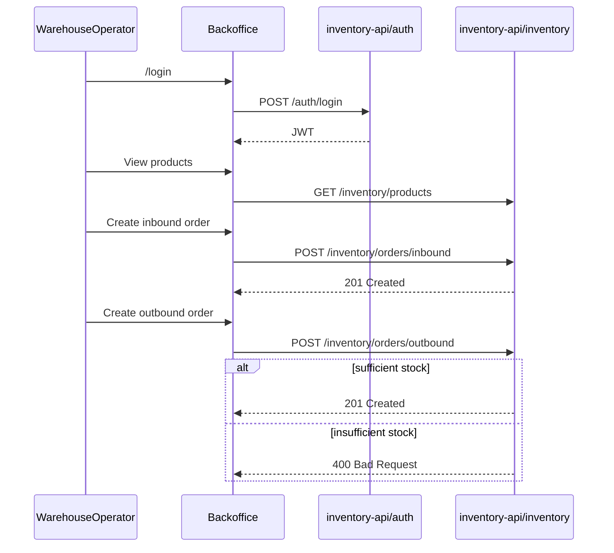

# TrackFlow Telemetry Plan

Design document for centralized telemetry across the TrackFlow monorepo. Early
drafts mapped instrumentation onto the milestone 5 inventory API
(`services/inventory-api/`); that server-side emission path was not adopted.

**Current contract (authoritative):** Runtime telemetry vocabulary is
`warehouse`, `client_id`, and `user_login_*` as documented in the root README
and implemented in `packages/shared/types/telemetry.ts`,
`data/pipelines/telemetry-stream/event-schemas.json`, and
`uis/backoffice/src/services/telemetry.ts`. The backoffice client emits events
through `track()` into the operations API (`services/main.py`
`POST /telemetry/events`). Inventory mutations still call authenticated
`inventory-api` endpoints on port 8003 for business data only — telemetry is not
emitted from `inventory-api`. Sections below that mention
`warehouse_location` / `client_brand` / `session_started` or inventory-api
emitters are historical design notes and must not override the runtime contract.

**Scope (historical note):** Early drafts were design-only. Schemas now live in
[data/pipelines/telemetry-stream/event-schemas.json](../../data/pipelines/telemetry-stream/event-schemas.json).

**Identifier rule:** Warehouses are `los_angeles` and `zaragoza`. Telemetry
properties use `warehouse` and `client_id` (not `warehouse_location` /
`client_brand`).

---

## Phase 1 — KPI Analysis and Data Opportunities

### 1.1 Three Main KPIs

TrackFlow's executive dashboard (CEO Daniel Espinoza) requires real-time visibility across both countries. The three primary KPIs below are drawn from CONTEXT.md Executive Direction and tie directly to warehouse operations (Ana Whitfield) and fulfillment.

#### KPI 1: On-Time Delivery Rate

| Aspect | Detail |
|--------|--------|
| **Definition** | Percentage of shipments delivered within the promised window per country/warehouse. |
| **Data composition** | `shipments` (total dispatched), `on_time_deliveries` (delivered within SLA), segmented by `warehouse_location` (`los_angeles` \| `zaragoza`) and carrier. |
| **Where generated** | Last-mile carrier status events (future `services/carrier-api/`). **Proxy today:** `POST /inventory/orders/outbound` success events correlated with carrier delivery timestamps once the last-mile module exists. Executive snapshot aggregation lives in `packages/shared/business-logic/milestone2.ts`. |

Ana Whitfield's teams in Los Angeles and Zaragoza currently have no shared view of fulfillment performance. On-time rate telemetry from outbound orders plus carrier events will let operations compare warehouse throughput against delivery SLA — a gap Carlos Vega's last-mile team cannot close today without structured data.

#### KPI 2: Return Rate

| Aspect | Detail |
|--------|--------|
| **Definition** | Percentage of shipped orders that result in a return (18–25% of volume per CONTEXT.md). |
| **Data composition** | `returned_orders`, `total_shipments`, segmented by `client_brand` and country. |
| **Where generated** | Reverse logistics flow (future `services/returns-api/`). **Proxy today:** executive snapshot inputs in milestone 2; return approval events once the returns module is built. |

Sofía Ramos's reverse logistics team approves every return manually. Return-rate telemetry by `client_brand` and SKU will surface which products drive the highest return volume — enabling automatic approval rules and reducing human review load.

#### KPI 3: Global Shipment Volume

| Aspect | Detail |
|--------|--------|
| **Definition** | Total count of fulfilled outbound shipments across both warehouses. |
| **Data composition** | Count of successful `outbound_order_created` events, summed by `warehouse_location` and time period. |
| **Where generated** | `POST /inventory/orders/outbound` in `services/inventory-api/app/routers/inventory.py` (milestone 5). Aggregated nightly for the executive weekly report. |

Daniel's Monday morning report is assembled manually and is already 1–2 days stale. Shipment volume from outbound order events feeds the executive dashboard with near-real-time fulfillment counts per warehouse, replacing hand-compiled director reports.

---

### 1.2 Inventory Management Flow Map

Authenticated warehouse operator flow from login through inbound or outbound order completion, mapped to milestone 5 API endpoints.



**Domain note:** TrackFlow does not expose a direct stock-edit endpoint. `current_stock` is computed as inbound sum minus outbound sum (`inventory_service.compute_current_stock`). Any attempt to reduce stock below zero is rejected at outbound creation.

---

### 1.3 Instrumentation Points

Every point below completes the rationale template:

> "We capture `[event_type]` because we need to know `[hypothesis]`, which allows us to make the decision `[decision]`."

| # | Trigger (API / UI) | `event_type` | Rationale |
|---|-------------------|--------------|-----------|
| 1 | `POST /auth/login` 200 | `session_started` | We capture `session_started` because we need to know **which operative is active and when shifts begin per warehouse**, which allows us to make the decision **to attribute inventory mutations to the correct operator and audit trail**. |
| 2 | `POST /auth/login` 401 | `credential_failed` | We capture `credential_failed` because we need to know **whether login failures spike at a warehouse or for a specific account**, which allows us to make the decision **to trigger a security review or targeted training before unauthorized access succeeds**. |
| 3 | JWT expiry / `ProtectedShell` redirect | `session_expired` | We capture `session_expired` because we need to know **how often operators lose sessions mid-flow and on which page**, which allows us to make the decision **to extend token TTL or simplify the inbound/outbound form before abandonment**. |
| 4 | `POST /inventory/products` 201 | `product_created` | We capture `product_created` because we need to know **how fast the SKU catalog grows per `client_brand` and warehouse**, which allows us to make the decision **to allocate shelf space and onboarding resources for new brand clients**. |
| 5 | `POST /inventory/products` 409 | `product_create_rejected` | We capture `product_create_rejected` because we need to know **how often duplicate SKU registrations occur**, which allows us to make the decision **to improve SKU validation UX and prevent catalog fragmentation**. |
| 6 | `POST /inventory/orders/inbound` 201 | `inbound_order_created` | We capture `inbound_order_created` because we need to know **receiving velocity per warehouse and SKU**, which allows us to make the decision **to staff receiving lanes and reconcile against inbound email orders**. |
| 7 | `POST /inventory/orders/outbound` 201 | `outbound_order_created` | We capture `outbound_order_created` because we need to know **fulfillment demand and resulting stock levels per SKU**, which allows us to make the decision **to prioritize picking queues and feed global shipment volume KPIs**. |
| 8 | `POST /inventory/orders/outbound` 400 | `outbound_order_rejected` | We capture `outbound_order_rejected` because we need to know **when and why outbound requests fail due to insufficient stock**, which allows us to make the decision **to halt pick/pack for that SKU and trigger procurement before customer-facing delays**. |
| 9 | Post-commit stock check: `current_stock <= low_stock_threshold` | `stock_threshold_triggered` | We capture `stock_threshold_triggered` because we need to know **which SKUs are at risk of stockout per warehouse**, which allows us to make the decision **to notify procurement and the `client_brand` before fulfillment fails**. |

---

### 1.4 Additional Backoffice Opportunities (Outside Inventory)

#### Authentication

| `event_type` | Hypothesis | Decision enabled |
|--------------|------------|------------------|
| `session_started` | Operative login patterns by time-of-day and warehouse | Shift staffing and access provisioning |
| `credential_failed` | Repeated failures indicate credential sharing or attacks | Lock accounts, enforce password reset |
| `session_expired` | Sessions die before order completion | Adjust JWT TTL, improve session renewal UX |

#### Navigation and Abandonment

| `event_type` | Hypothesis | Decision enabled |
|--------------|------------|------------------|
| `page_viewed` | Which backoffice sections operators visit and how often | Prioritize UI investment for high-traffic workflows |
| `form_abandoned` | Operators start inbound/outbound forms but do not submit | Simplify forms, add draft-save, or provide inline stock preview |

**Rationale for `page_viewed`:** We capture `page_viewed` because we need to know **which backoffice sections warehouse operatives use most**, which allows us to make the decision **to prioritize UX improvements on the highest-traffic inventory screens**.

**Rationale for `form_abandoned`:** We capture `form_abandoned` because we need to know **at which step operators abandon inbound or outbound forms**, which allows us to make the decision **to reduce friction before orders are lost to incomplete submissions**.

---

## Phase 2 — Event Envelope Design

### 2.1 Standard Event Envelope

Every emitted event MUST include these fields. No additional top-level keys are permitted.

| Field | Type | Required | Description |
|-------|------|----------|-------------|
| `eventId` | `string` (UUID v4) | Yes | Unique identifier for this event instance. |
| `timestamp` | `string` (ISO 8601) | Yes | UTC emission time, e.g. `2026-07-07T14:30:00.000Z`. |
| `sessionId` | `string` (UUID v4) | Yes | Browser session identifier, generated on login. |
| `userId` | `string` | Yes | `user_uuid` from JWT claims, or `"anonymous"` for unauthenticated events. |
| `event_type` | `string` | Yes | `entity_action` taxonomy (see event catalog below). |
| `schemaVersion` | `string` (semver) | Yes | Schema version, currently `1.0.0`. |
| `requestId` | `string` | Yes | Correlation ID from `X-Request-ID` header for tracing across API calls. |
| `properties` | `object` | Yes | Event-specific payload. Keys MUST match the event's property allowlist. |

**Correlation strategy:** FastAPI middleware generates or propagates `requestId`. Backoffice `api-client.ts` sends `X-Request-ID` on every API call.

**Example envelope:**

```json
{
  "eventId": "a1b2c3d4-e5f6-7890-abcd-ef1234567890",
  "timestamp": "2026-07-07T14:30:00.000Z",
  "sessionId": "b2c3d4e5-f6a7-8901-bcde-f12345678901",
  "userId": "usr_7f3a2b1c",
  "event_type": "inbound_order_created",
  "schemaVersion": "1.0.0",
  "requestId": "req_9e8d7c6b",
  "properties": {
    "order_id": 42,
    "product_id": 7,
    "sku": "TF-SHOE-001",
    "quantity": 50,
    "warehouse_location": "los_angeles",
    "client_brand": "AcmeApparel"
  }
}
```

---

### 2.2 Event Catalog

All `event_type` values follow the `entity_action` taxonomy with consistent past-tense verbs.

#### `session_started`

| Property | Type | Required | Description |
|----------|------|----------|-------------|
| `auth_method` | `string` | Yes | Always `"password"` for milestone 5. |
| `is_admin` | `boolean` | No | Whether the user has admin privileges. |

- **Description:** Operator successfully authenticated via `POST /auth/login`.
- **PII:** `userId` envelope field is a pseudonymous UUID. No email or password in `properties`.
- **Sanitization:** Never emit JWT token, email, or password.

#### `credential_failed`

| Property | Type | Required | Description |
|----------|------|----------|-------------|
| `email_hash` | `string` | Yes | SHA-256 hash of attempted email (not reversible). |
| `failure_reason` | `string` | Yes | `"invalid_credentials"` \| `"account_inactive"`. |

- **Description:** Failed login attempt on `POST /auth/login` returning 401.
- **PII:** Email is hashed before emission. Raw email MUST NOT appear in properties.
- **Sanitization:** Hash email with SHA-256 + server salt. Strip `Authorization` header from debug payloads.

#### `session_expired`

| Property | Type | Required | Description |
|----------|------|----------|-------------|
| `last_page` | `string` | Yes | Route path where session expired, e.g. `/inventory/inbound`. |
| `session_duration_seconds` | `integer` | Yes | Seconds from `session_started` to expiry. |

- **Description:** JWT expired and `ProtectedShell` redirected to `/login`.
- **PII:** None in properties.
- **Sanitization:** N/A.

#### `product_created`

| Property | Type | Required | Description |
|----------|------|----------|-------------|
| `product_id` | `integer` | Yes | Database product ID. |
| `sku` | `string` | Yes | Unique SKU identifier. |
| `warehouse_location` | `string` | Yes | `"los_angeles"` \| `"zaragoza"`. |
| `client_brand` | `string` | Yes | Brand client name. |
| `low_stock_threshold` | `integer` | No | Configured threshold (default 10). |

- **Description:** New product registered via `POST /inventory/products` returning 201.
- **PII:** `client_brand` is B2B metadata, not end-consumer PII.
- **Sanitization:** N/A.

#### `product_create_rejected`

| Property | Type | Required | Description |
|----------|------|----------|-------------|
| `sku` | `string` | Yes | SKU that caused the conflict. |
| `rejection_reason` | `string` | Yes | Always `"duplicate_sku"`. |
| `existing_product_id` | `integer` | No | ID of the conflicting product. |

- **Description:** Product creation rejected with 409 due to duplicate SKU.
- **PII:** None.
- **Sanitization:** N/A.

#### `inbound_order_created`

| Property | Type | Required | Description |
|----------|------|----------|-------------|
| `order_id` | `integer` | Yes | Inbound order ID. |
| `product_id` | `integer` | Yes | Product receiving stock. |
| `sku` | `string` | Yes | SKU identifier. |
| `quantity` | `integer` | Yes | Units received (positive). |
| `warehouse_location` | `string` | Yes | `"los_angeles"` \| `"zaragoza"`. |
| `client_brand` | `string` | Yes | Brand client owning the SKU. |

- **Description:** Inbound order committed via `POST /inventory/orders/inbound` returning 201.
- **PII:** None.
- **Sanitization:** N/A.

#### `outbound_order_created`

| Property | Type | Required | Description |
|----------|------|----------|-------------|
| `order_id` | `integer` | Yes | Outbound order ID. |
| `product_id` | `integer` | Yes | Product losing stock. |
| `sku` | `string` | Yes | SKU identifier. |
| `quantity` | `integer` | Yes | Units shipped (positive). |
| `warehouse_location` | `string` | Yes | `"los_angeles"` \| `"zaragoza"`. |
| `resulting_stock` | `integer` | Yes | `current_stock` after outbound commit. |

- **Description:** Outbound order committed via `POST /inventory/orders/outbound` returning 201.
- **PII:** None.
- **Sanitization:** N/A.

#### `outbound_order_rejected`

| Property | Type | Required | Description |
|----------|------|----------|-------------|
| `product_id` | `integer` | Yes | Product with insufficient stock. |
| `sku` | `string` | Yes | SKU identifier. |
| `requested_quantity` | `integer` | Yes | Quantity the operator attempted to ship. |
| `available_stock` | `integer` | Yes | `current_stock` at time of rejection. |
| `rejection_reason` | `string` | Yes | Always `"insufficient_stock"`. |

- **Description:** Outbound order rejected with 400 because `current_stock - quantity < 0`.
- **PII:** None.
- **Sanitization:** N/A.

#### `stock_threshold_triggered`

| Property | Type | Required | Description |
|----------|------|----------|-------------|
| `product_id` | `integer` | Yes | Product below threshold. |
| `sku` | `string` | Yes | SKU identifier. |
| `current_stock` | `integer` | Yes | Stock level at trigger time. |
| `low_stock_threshold` | `integer` | Yes | Configured threshold on the product. |
| `warehouse_location` | `string` | Yes | `"los_angeles"` \| `"zaragoza"`. |
| `client_brand` | `string` | Yes | Brand client to notify. |

- **Description:** Emitted after any stock-changing operation when `current_stock <= low_stock_threshold`.
- **PII:** None.
- **Sanitization:** N/A.

#### `page_viewed`

| Property | Type | Required | Description |
|----------|------|----------|-------------|
| `page_path` | `string` | Yes | Route path, e.g. `/inventory/products`. |
| `referrer_path` | `string` | No | Previous page path. |

- **Description:** Operator navigated to a backoffice page.
- **PII:** None.
- **Sanitization:** N/A.

#### `form_abandoned`

| Property | Type | Required | Description |
|----------|------|----------|-------------|
| `form_type` | `string` | Yes | `"inbound"` \| `"outbound"` \| `"product"`. |
| `last_field` | `string` | No | Last focused field name before abandonment. |
| `elapsed_seconds` | `integer` | Yes | Time spent on form before abandonment. |

- **Description:** Operator opened a form but navigated away without submitting.
- **PII:** None.
- **Sanitization:** Do not capture field values — only field names.

---

### 2.3 Property Allowlist Enforcement

Each event's `properties` object MUST contain only the keys listed in its spec above. Emitters MUST validate against the allowlist before sending. The JSON Schema export in `event-schemas.json` enforces this at validation time via `additionalProperties: false` on each event variant.

---

## Phase 3 — Delivery Strategy

### 3.1 Stream vs Batch Processing

Processing mode is chosen by **business urgency of the decision** the data supports, not by technical preference.

| `event_type` | Processing | Justification |
|--------------|-----------|---------------|
| `stock_threshold_triggered` | **Stream** (real-time) | Ana Whitfield needs low-stock alerts before the next outbound fails. Procurement and client notification must happen within minutes, not overnight. |
| `outbound_order_rejected` | **Stream** (real-time) | Pick/pack operatives must stop processing a SKU immediately when stock is insufficient. Delayed batch processing would cause repeated failed attempts. |
| `credential_failed` | **Stream** (real-time) | Security team must detect brute-force patterns within minutes to lock accounts before unauthorized access. |
| `session_started` | **Stream** (real-time) | Active session count supports real-time ops dashboard for shift monitoring. |
| `session_expired` | **Batch** (hourly) | UX analytics on session length — decisions about JWT TTL are made weekly, not in real time. |
| `inbound_order_created` | **Batch** (nightly) | Receiving velocity trends feed the executive weekly report. No operational decision requires sub-hour inbound data. |
| `outbound_order_created` | **Batch** (nightly) | Shipment volume KPI aggregation for Daniel's Monday report. Individual outbound events are logged immediately but aggregated nightly. |
| `product_created` | **Batch** (nightly) | Catalog growth is a strategic metric reviewed monthly by commercial team. |
| `product_create_rejected` | **Batch** (hourly) | Duplicate SKU conflicts are infrequent; hourly aggregation suffices for UX improvements. |
| `page_viewed` | **Batch** (nightly) | Navigation patterns inform quarterly UX prioritization, not real-time ops. |
| `form_abandoned` | **Batch** (hourly) | Form completion rates are reviewed weekly during sprint planning. |

---

### 3.2 Throttle and Debounce Strategy

High-frequency events require volume management to control cost and processing load.

| `event_type` | Strategy | Rule |
|--------------|----------|------|
| `page_viewed` | **Debounce** | Emit at most 1 event per `(sessionId, page_path)` every 30 seconds. |
| `stock_threshold_triggered` | **Throttle** | Emit at most 1 event per `(sku, warehouse_location)` every 4 hours while stock remains below threshold. Re-emit only when stock recovers above threshold and drops again. |
| `credential_failed` | **Throttle** | Emit at most 5 events per `(ip_hash, email_hash)` every 15 minutes to the telemetry stream. All failures are still logged server-side in full for security audit. |
| `session_expired` | **Debounce** | Emit at most 1 event per `sessionId` per expiry (no duplicate on redirect loops). |

---

### 3.3 Risks and Exclusions

#### Discarded Events

| Discarded `event_type` | Reason |
|------------------------|--------|
| `direct_stock_edit_rejected` | TrackFlow's domain model computes stock from inbound minus outbound orders. There is no direct stock-edit endpoint, so this event has no emission point. Outbound rejection (`outbound_order_rejected`) covers the equivalent business case. |
| `form_field_changed` (per-keystroke) | No business decision is attached to individual field edits. High volume, high cost, no hypothesis. Form abandonment (`form_abandoned`) captures the actionable signal. |
| `carrier_status_polled` | Last-mile carrier API polling is out of scope until `services/carrier-api/` exists. Raw polling events would generate excessive volume with no unified carrier schema yet. |
| `health_check_ping` | Infrastructure health checks are operational logs, not business telemetry. Belongs in centralized logging (CONTEXT.md Technology need), not the event pipeline. |

#### Data Not Captured

| Data | Reason |
|------|--------|
| End-consumer PII (recipient name, address, phone) | Privacy / GDPR — TrackFlow processes parcels but telemetry scope is warehouse operations and B2B clients, not B2C recipients. |
| Full JWT tokens | Security — tokens in telemetry would create a credential leak vector. Only `user_uuid` (pseudonymous) is emitted. |
| Raw email addresses | Privacy — hashed to `email_hash` in `credential_failed` events only. |
| Passwords (plaintext or hashed) | Security — never emitted under any circumstance. |
| `client_brand` contract values / pricing | Commercial sensitivity — contract terms are not operational telemetry. |
| Operative GPS location / biometric data | Privacy — no business need for warehouse telemetry. |
| Full HTTP request/response bodies | Cost and security — only structured event properties from the allowlist are captured. |

---

## Implementation Notes

- **Emitters (canonical):** Client-side `track()` in `uis/backoffice/src/services/telemetry.ts` posts to operations `POST /telemetry/events`. Do not add inventory-api emitters.
- **Schema export:** [data/pipelines/telemetry-stream/event-schemas.json](../../data/pipelines/telemetry-stream/event-schemas.json)
- **TypeScript types:** [packages/shared/types/telemetry.ts](../../packages/shared/types/telemetry.ts)
- **Validation:** See [data/pipelines/telemetry-stream/README.md](../../data/pipelines/telemetry-stream/README.md)
